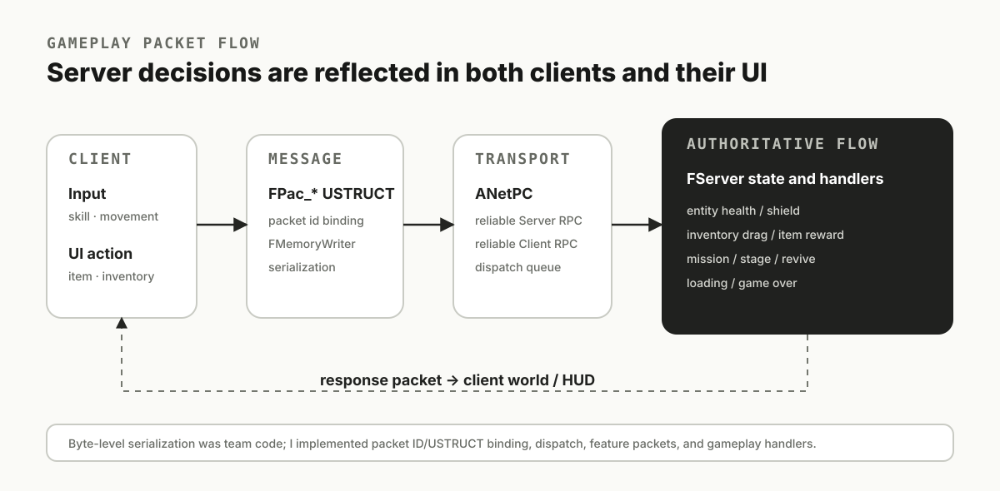
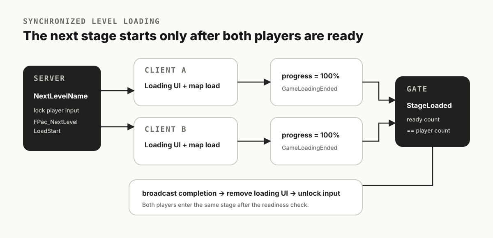
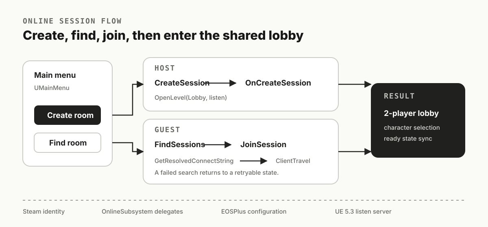
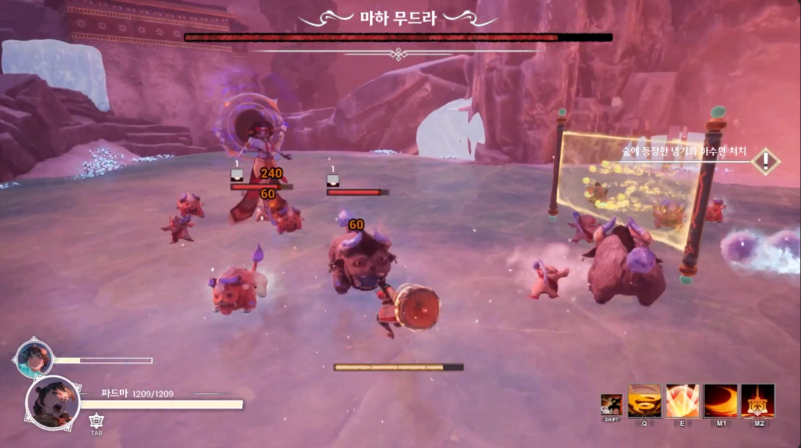

# Nirvana — Networking Evidence Package

> Draft evidence package for the game-server portfolio.  
> This branch contains only information already exposed in the existing public portfolio. Final project source code is **not** copied here yet.

## What this project proves

Nirvana is a two-player Unreal Engine action roguelike developed by a 22-person team, with four programmers working on the project for roughly eight months.

For a game-server portfolio, the useful evidence is the part where gameplay state had to be coordinated between two players and a server-authoritative flow.

### My contribution

- Packet ID–USTRUCT binding and dispatch
- Server-authoritative gameplay state handling
- Two-player item interaction conflict prevention
- Stage loading synchronization barrier
- Session create / search / join flow
- Health, shield, revival, and game-over state synchronization

The portfolio should emphasize these items as concrete responsibilities rather than long narrative paragraphs.

## Evidence 1 — Gameplay packet and server-state flow

The existing public portfolio records the following flow:

`Client Input / UI Action → Reliable RPC → Server Dispatch Queue → Server State Decision → Client Apply`

The packet serialization foundation was shared team code. My documented contribution starts at the packet binding/dispatch layer and extends into the gameplay handlers that apply server decisions.

## Evidence 2 — Synchronized level loading

The important server-side behavior is the loading barrier:

1. Server selects the next stage.
2. Both clients enter loading and input is locked.
3. Each client reports completion.
4. Server tracks each player's loaded state.
5. Gameplay resumes only when all active players are ready.

This is a stronger server-portfolio example than simply saying that loading UI was implemented.

## Evidence 3 — Online session flow

The existing public portfolio documents the Online Subsystem flow as:

`Init → Searching → Found → Joining → Joined`

The useful evidence is the ordering around session join completion, resolving the connect string, and then performing client travel.

## Gameplay

## Code evidence already public in the portfolio

The current public portfolio includes short excerpts attributed to these final-project paths:

- `YC/OSS/NrvOss.cpp`
  - session join completion
  - resolved address lookup
  - `ClientTravel`
- `YC/Core/Server/Server.cpp`
  - per-client `StageLoaded`
  - ready-count barrier
  - `FPac_GameLoadingEnded`
  - gameplay packet handlers
- `YC/Core/Client/Client.cpp`
  - client-side state application
- `YC/NetAnim.cpp`
  - multiplayer montage state synchronization

These paths are documentation references only at this stage. The GitHub repository currently connected for Nirvana does not expose the same final source tree, so this package must not pretend those files are already publicly verifiable.

## Public-source verification status

| Evidence | Status |
| --- | --- |
| Gameplay screenshot | Ready |
| Packet-flow diagram | Ready |
| Loading-sync diagram | Ready |
| Session-flow diagram | Ready |
| Final Server.cpp | Pending source extraction |
| Final Client.cpp | Pending source extraction |
| Final NrvOss.cpp | Pending source extraction |
| Final packet binding code | Pending source extraction |
| Author ownership / edit scope | Must be verified from final local source / history |

## What must be extracted from the final local source

Only publish files or excerpts that can be clearly attributed to my own implementation or modifications.

Target evidence:

1. **Packet binding / dispatch**
   - packet ID ↔ USTRUCT registration
   - typed dispatch into server/client handlers

2. **Server-authoritative item interaction**
   - player interaction request
   - server-side ownership / drag-state check
   - result broadcast or targeted response

3. **Stage loading barrier**
   - client completion signal
   - server ready counter / state
   - resume only after all active players finish

4. **Session join**
   - join callback
   - resolved connect string
   - client travel ordering

5. **Game-state decisions**
   - health / shield
   - revival
   - game-over
   - any other state where the server is the source of truth

## Publication rule

Before copying code from the team repository:

- confirm that the excerpt is authored or substantially modified by me;
- remove unrelated team code;
- remove secrets, account identifiers, backend endpoints, and private project data;
- preserve enough surrounding context to explain the implementation;
- document shared-team foundations explicitly;
- do not publish assets or source that the team did not authorize for public use.

## Portfolio page order

Recommended reading order:

1. Two-player gameplay image / short GIF
2. Project metadata and my role
3. Five responsibility bullets
4. Packet / authority architecture
5. Technical Case: server-authoritative item interaction
6. Technical Case: two-client loading barrier
7. Technical Case: online-session join flow
8. Folded code excerpts with exact source links
9. Scope and ownership note

## Next action

Locate the final Nirvana source on the local machine and fill the evidence inventory in [SOURCE_INVENTORY.md](./SOURCE_INVENTORY.md). Once authorship and publication scope are verified, copy only the approved excerpts into a dedicated public mirror repository.
